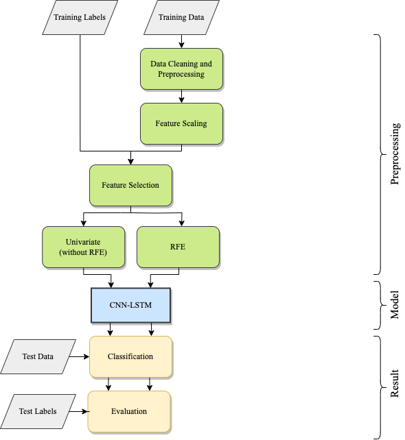
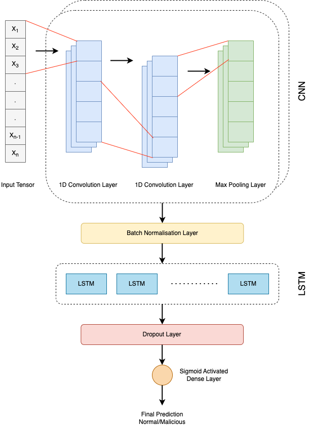

# A Hybrid CNN-LSTM Approach for Intelligent Cyber Intrusion Detection System

This repo is for providing access to the code of the paper ["A Hybrid CNN-LSTM Approach for Intelligent Cyber Intrusion Detection System"](https://doi.org/10.1016/j.cose.2024.104146).

## Introduction
With the rapid digitalization of critical infrastructure, safeguarding against sophisticated cyber threats has become paramount. This paper presents a **hybrid deep learning approach** for an **Intrusion Detection System (IDS)** using the **CNN-LSTM** model, focusing on the NSL-KDD dataset. Through feature selection and model optimization, this system aims to accurately differentiate between malicious and benign network traffic, thereby enhancing cybersecurity.

## Methodology
The proposed IDS employs:
- **Dataset**: NSL-KDD, an improvement over the original KDD Cup 1999 dataset, designed for more balanced and realistic intrusion detection.
- **Feature Selection**: Recursive Feature Elimination (RFE) using a Decision Tree classifier, which identifies the most relevant features to reduce dimensionality and improve model performance.
- **Model Architecture**: A CNN-LSTM network combining **CNN layers** for feature extraction with **LSTM layers** for temporal pattern analysis. The model is trained with binary cross-entropy loss and optimized using the Adam optimizer.

<p align="center">
  
</p>

### CNN-LSTM Model Overview
- **Convolutional Layers**: Two sets of 1D convolutional layers with 64 and 128 filters, interspersed with max-pooling and batch normalization for dimensionality reduction and overfitting prevention.
- **LSTM Layer**: A 100-unit LSTM layer capturing temporal dependencies within the data.
- **Output**: Dense layer for binary classification between normal and intrusive traffic.

<p align="center">
  
</p>


## Results
The CNN-LSTM model demonstrated superior performance, particularly with RFE. Key metrics include:
- **Accuracy**: 95%
- **Recall**: 0.89
- **F1-Score**: 0.94
- **AUC-ROC**: 0.948, indicating high true positive rates against false positive rates

This performance is higher than other tested models (ANN, LSTM, GRU), making CNN-LSTM the most effective for this IDS.

### Comparative Performance with RFE
| Model     | Accuracy | Precision | Recall | F1-Score |
|-----------|----------|-----------|--------|----------|
| ANN       | 0.91     | 0.99      | 0.81   | 0.89     |
| LSTM      | 0.87     | 0.87      | 0.82   | 0.84     |
| CNN-LSTM  | 0.95     | 0.98      | 0.89   | 0.94     |

## Installation
The model is provided in the notebook format. Download the NSL KDD+ dataset before running the src/Intrusion_Detection.ipynp notebook. 

## Usage

The model can be applied to detect potential intrusions in real-time network traffic data by deploying it as part of a larger cybersecurity pipeline.

## Citation

If you find this work useful, please cite it as follows:

```bash
@article{Bamber2025HybridCNNLSTM,
  title={A hybrid CNN-LSTM approach for intelligent cyber intrusion detection system},
  author={Sukhvinder Singh Bamber, Aditya Vardhan Reddy Katkuri, Shubham Sharma, Mohit Angurala},
  journal={Computers & Security},
  volume={148},
  pages={104146},
  year={2025}
}
```


